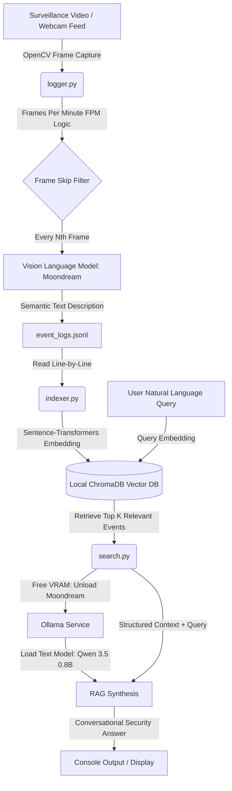

# 👁️ SemanticSurveillance-RAG

A high-efficiency, privacy-first local surveillance system that replaces resource-heavy video storage with semantic, searchable event logs. 

By analyzing video feeds frame-by-frame with a Vision-Language Model (VLM), the system converts visual details into structured JSONL logs. These logs are vectorized and indexed into a local vector database, enabling you to query your visual history using natural language (RAG).

---

## 🏗️ System Architecture Flow

The system runs entirely locally on consumer hardware, optimizing GPU VRAM footprint by dynamically loading/unloading models.



---

## 💻 Hardware & Model Requirements

Because this pipeline loads and unloads models dynamically between steps, it can run comfortably on consumer-grade hardware with limited VRAM.

### Local Models (Ollama)
| Model | Type | Parameters | VRAM Requirement | RAM/Disk Size |
|---|---|---|---|---|
| **Moondream** | Vision-Language Model (VLM) | ~860M | ~2.2 GB | ~1.6 GB |
| **Qwen 3.5 0.8B** | Text LLM (RAG Reasoner) | ~800M | ~1.2 GB | ~1.0 GB |

### GPU / Hardware Recommendations
- **Minimum VRAM**: **4 GB** (e.g., NVIDIA T4, RTX 3050, RTX 2060).
- **Recommended VRAM**: **6 GB+** (e.g., RTX 3060, RTX 4060) for faster model switching and inference.
- **Dynamic VRAM Optimization**: The system automatically unloads the VLM (Moondream) from the GPU memory (`keep_alive: 0`) before launching Qwen. This caps the peak VRAM usage to **~2.5 GB**, ensuring it runs safely without out-of-memory crashes on low-end systems.

---

## ⚙️ How it Works

### 1. VLM Event Logger (`logger.py`)
- Reads a camera index (`0` for webcam) or path to a video file.
- Instead of processing every frame (which is computationally expensive), it calculates a frame-skip interval based on a user-defined **Frames Per Minute (FPM)** rate.
- For a source video with frame rate $FPS$, the frame interval is calculated as:
  $$\text{Frame Interval} = \frac{FPS \times 60}{\text{FPM}}$$
- Key frames are sent to **Moondream** (VLM) running on a local Ollama instance to describe the scene in detail.
- Timestamped outputs are written to `event_logs.jsonl`.

### 2. Vector DB Indexer (`indexer.py`)
- Reads the flat-file logs in `event_logs.jsonl`.
- Generates vector embeddings of each scene description.
- Populates a local **ChromaDB** vector database.

### 3. RAG Search Engine (`search.py`)
- User inputs a search query (e.g., *"What were the workers doing near the forklift?"*).
- ChromaDB performs semantic similarity search to retrieve the most contextually relevant timestamps and descriptions.
- **VRAM Optimization Trick**: The engine sends a request to Ollama to unload the heavy Moondream VLM model from the GPU (`keep_alive: 0`) before launching the **Qwen 3.5 0.8B** text model. This prevents VRAM saturation and out-of-memory errors on mid-range GPUs.
- Qwen synthesizes the relevant context into a coherent, natural language answer.

---

## 🚀 Getting Started

### Prerequisites
- Python 3.10+
- [Ollama](https://ollama.com/) running locally

### Installation

1. Clone the repository and navigate to the directory:
   ```bash
   git clone https://github.com/YOUR_USERNAME/semantic-surveillance-rag.git
   cd semantic-surveillance-rag
   ```

2. Install dependencies:
   ```bash
   pip install -r requirements.txt
   ```

3. Download the local models through Ollama:
   ```bash
   ollama pull moondream
   ollama pull qwen3.5:0.8b
   ```

---

## 🎮 How to Use

The project includes an interactive terminal UI menu helper:
```bash
chmod +x start.sh
./start.sh
```

### Options inside Menu:
* **Option 1: Start Logger**
  - Prompt for video file path (or `0` for webcam) and target FPM.
  - Generates `event_logs.jsonl`.
* **Option 2: Run Indexer**
  - Processes `event_logs.jsonl` and updates the ChromaDB vector database.
* **Option 3: Start RAG Search**
  - Opens a prompt where you can query your logs using natural language.
* **Option 4: Generate Dummy Logs**
  - Generates fake surveillance logs for system testing and validation.

---

## 📁 Repository Structure

```
├── README.md               # Project documentation
├── requirements.txt        # Python libraries
├── start.sh                # Main shell-based interactive launcher
├── logger.py               # Frame capture and VLM description generator
├── indexer.py              # ChromaDB vector embedding setup
├── search.py               # RAG search UI and Qwen text model orchestrator
├── create_dummy_logs.py    # Test dataset generator
└── run_test.py             # Automatic testing runner script
```

---

## 🏷️ Suggested Repository Names
- `semantic-surveillance-rag` (Recommended: clear, describes both domain and technology)
- `vlm-event-logger-rag`
- `smart-eye-rag`
- `local-vision-rag`
